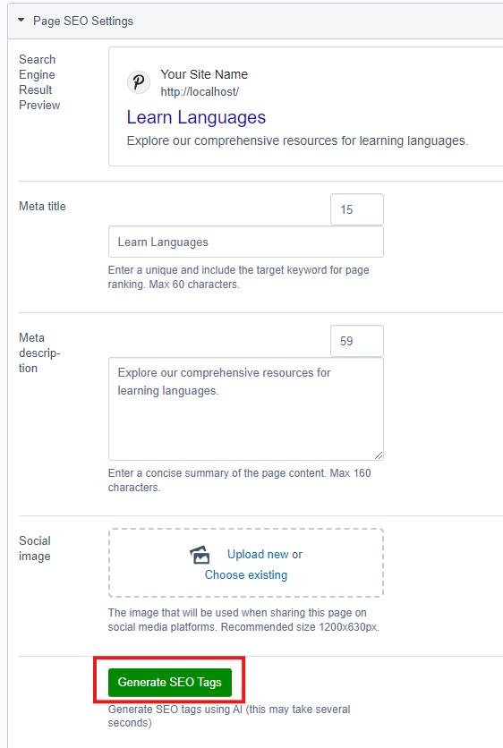

# Silverstripe SEO AI Module
This module extends [Silverstripe SEO](https://github.com/PlasticStudio/Silverstripe-SEO) to allow users to generate SEO tags with the OpenAI API.

## Installation
```sh 
composer require "plasticstudio/silverstripe-seo-ai" 
```

## Setting Up
After installing the module, configure the API and model / temperature settings via YAML.

Any model with text input / output on [OpenAI's Platform](https://platform.openai.com/docs/models) will work, GPT-4o Mini is the default (recommended).

*app/_config/seo-ai.yml*
```yaml
---
Name: silverstripe-seo-ai
---
SilverStripe\Core\Injector\Injector:
  PlasticStudio\SEOAI\Extensions\SeoAICMSPageEditControllerExtension:
    properties:
      openaiKey: "`OPENAI_API_KEY`"
      model: "gpt-4o-mini"
      temperature: 0
```

## Optional: Include / Exclude Specific DOM Elements

You can optionally define which DOM elements should be included or excluded when generating SEO content.
By default, the module includes common content elements (p, h1–h6, li) and excludes structural elements (header, footer, nav).

This allows you to fine-tune content parsing for your custom site structure.

Example:
```yaml
---
Name: silverstripe-seo-ai
---
SilverStripe\Core\Injector\Injector:
  PlasticStudio\SEOAI\Extensions\SeoAICMSPageEditControllerExtension:
    properties:
      openaiKey: "sk-proj-xxxxxxxxxxxxxxxxxxxxxxxxxxxxxxxx"
      model: "gpt-4o-mini"
      temperature: 0
      included_dom_selectors:
        - "p"
        - "h1"
        - "h2"
        - "h3"
        - "h4"
        - "h5"
        - "h6"
        - "li"
        - ".class_one"
        - "#ObjectTwo"
      excluded_dom_selectors:
        - "header"
        - "footer"
        - "nav"
        - "form"
        - "#ObjectOne"
        - ".class__two"

```

## Usage

Currently this module generates tags for the fields "Meta Title" and "Meta Description".

To generate tags, navigate to the page you'd like to generate tags for and click "Generate SEO Tags" in the "Page SEO Settings" section.



[Zoomed Out Screenshot](docs/images/zoomed-out-screenshot.png)

Once this process has completed, publish the page as you would normally. 
